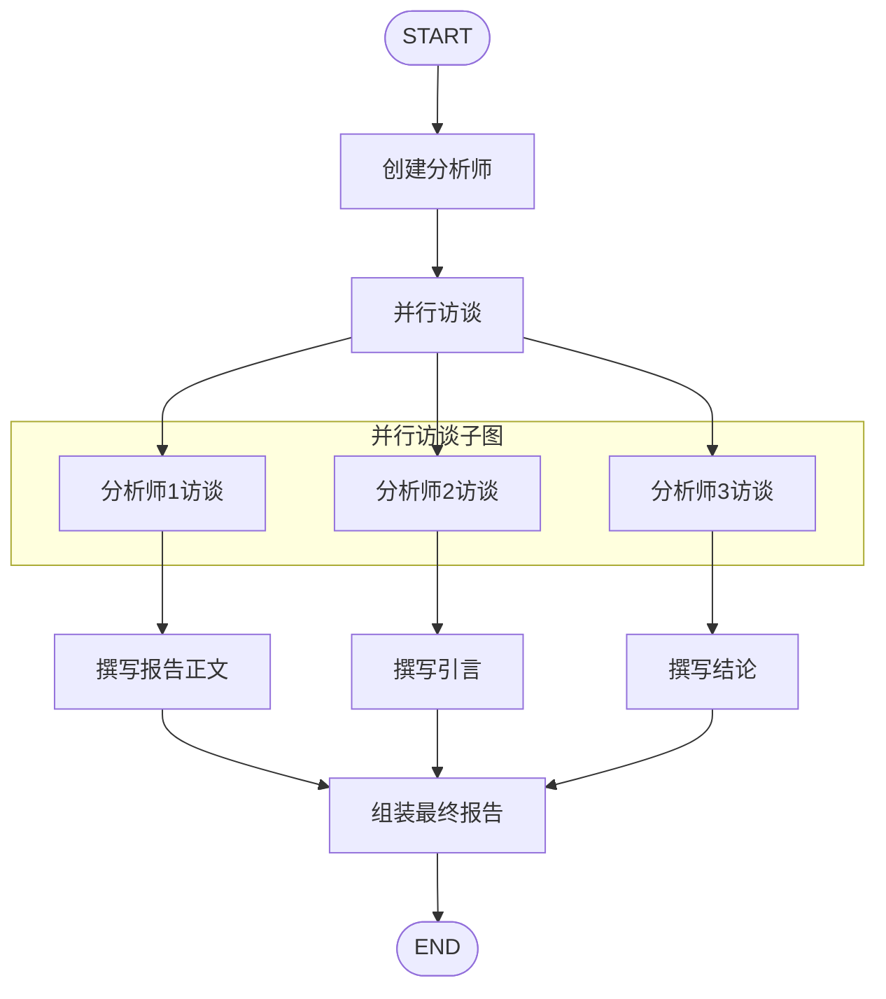
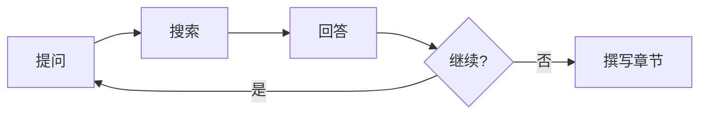

# STORM 研究助手

基于 LangGraph 构建的智能研究报告生成系统。系统能够根据研究主题自动生成多视角、深度的研究报告。

## 功能特性

- **多视角分析**：自动生成多个专业分析师人设，从不同角度深入研究主题
- **智能访谈**：分析师与专家进行多轮对话，深入挖掘研究问题
- **多源检索**：集成 Tavily 网络搜索和 ArXiv 学术论文搜索
- **并行处理**：支持多个访谈并行执行，提升效率
- **学术级报告**：生成符合学术标准的结构化研究报告
- **多模型支持**：支持阿里云百炼、OpenAI、Azure OpenAI、Anthropic 等多种 LLM

## 系统架构



## 项目结构

```
STORM/
├── storm/                   # 核心代码目录
│   ├── main.py             # 程序入口
│   ├── graph.py            # LangGraph 图定义
│   ├── state.py            # 状态定义
│   ├── tools.py            # 搜索工具（Tavily、ArXiv）
│   ├── prompts.py          # 提示词模板
│   ├── configuration.py    # 配置管理
│   ├── utils.py            # 工具函数
│   └── .envexample         # 环境变量示例
├── docs/                    # 文档目录
│   └── 运行流程.md          # 详细运行流程说明
├── result/                  # 运行结果目录
│   └── 运行结果.md          # 示例输出
└── README.md               # 项目说明
```

## 快速开始

### 1. 环境准备

确保已安装 Python 3.11+，然后安装依赖：

```bash
pip install langgraph langchain langchain-openai langchain-anthropic langchain-community python-dotenv
```

### 2. 配置环境变量

复制环境变量示例文件：

```bash
cp storm/.envexample storm/.env
```

编辑 `.env` 文件，填入必要的 API Key：

```env
# 阿里云百炼 API Key（推荐）
BAILIAN_API_KEY=your_bailian_api_key

# Tavily Search API（网络搜索功能必需）
TAVILY_API_KEY=your_tavily_api_key

# 可选：其他模型提供商
# OPENAI_API_KEY=your_openai_api_key
# AZURE_OPENAI_ENDPOINT=your_azure_endpoint
# AZURE_OPENAI_API_KEY=your_azure_api_key
# ANTHROPIC_API_KEY=your_anthropic_api_key
```

### 3. 运行程序

```bash
cd storm
python main.py
```

## 配置说明

系统支持通过 `config` 参数自定义运行配置：

```python
config = {
    "configurable": {
        "model": "bailian/qwen-plus",      # LLM 模型
        "max_analysts": 3,                  # 分析师数量
        "max_interview_turns": 2,           # 访谈轮数
        "tavily_max_results": 3,            # 网络搜索结果数
        "arxiv_max_docs": 3,                # ArXiv 文档数
        "parallel_interviews": True,        # 并行访谈
        "enable_checkpointing": True,       # 启用检查点
    }
}
```

### 支持的模型

| 提供商 | 模型示例 |
|--------|----------|
| 阿里云百炼 | `bailian/qwen-plus`, `bailian/qwen-turbo`, `bailian/qwen-max` |
| OpenAI | `openai/gpt-4.1`, `openai/gpt-4.1-mini` |
| Azure OpenAI | `azure/gpt-4.1` |
| Anthropic | `anthropic/claude-opus-4-20250514`, `anthropic/claude-3-7-sonnet-latest` |

## 核心流程

### 1. 分析师生成

根据研究主题自动生成多个专业分析师人设，每位分析师具有独特的视角和专业领域。

### 2. 并行访谈

每位分析师独立进行访谈流程：



- **提问**：分析师基于人设提出研究问题
- **搜索**：并行执行网络搜索和学术论文搜索
- **回答**：基于搜索结果生成专家回答
- **撰写章节**：整合访谈内容撰写报告章节

### 3. 报告生成

并行执行三个任务：
- 撰写报告正文（整合所有章节）
- 撰写引言
- 撰写结论

### 4. 最终组装

将引言、正文、结论组装成完整的研究报告。

## 输出示例

系统生成的报告包含以下结构：

```markdown
# [研究主题]

## 引言
[背景介绍和报告预览]

---

## 核心观点

### 背景与理论基础
### 文献综述与相关工作
### 问题定义与研究问题
### 方法论与分析框架
### 结果与发现
### 批判性分析与讨论
### 战略影响与建议

---

## 结论
[总结与未来展望]

## 来源
[参考文献列表]
```

## API 获取

- **阿里云百炼**：https://bailian.console.aliyun.com/
- **Tavily Search**：https://tavily.com/
- **OpenAI**：https://platform.openai.com/
- **Anthropic**：https://console.anthropic.com/

## 技术栈

- **LangGraph**：状态图编排框架
- **LangChain**：LLM 应用开发框架
- **Tavily Search**：AI 优化的搜索引擎 API
- **ArXiv API**：学术论文检索

## 许可证

MIT License

## 参考资料

详细的运行流程说明请参阅 [docs/运行流程.md](docs/运行流程.md)