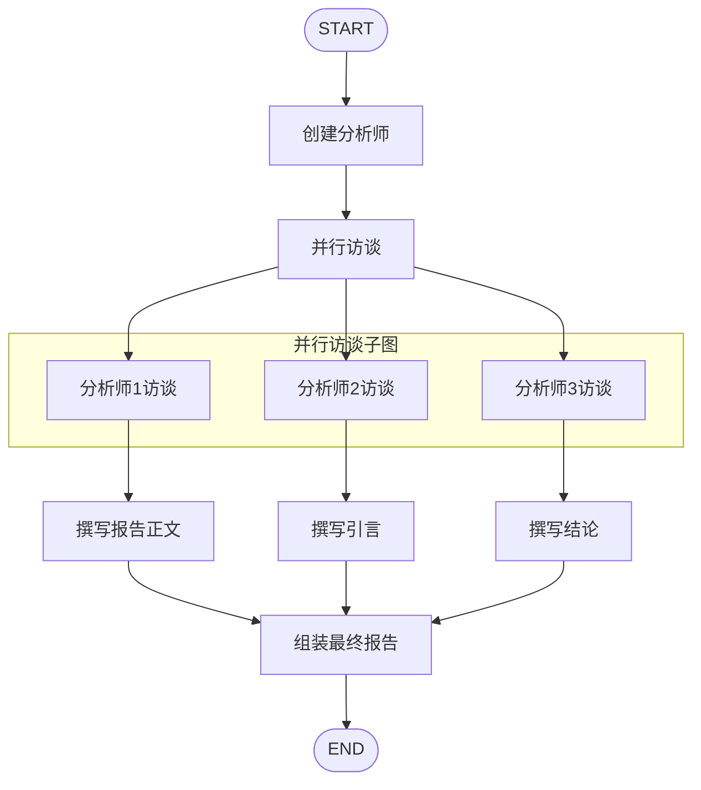
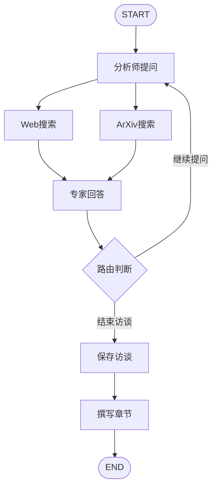
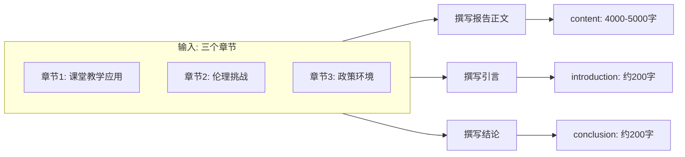
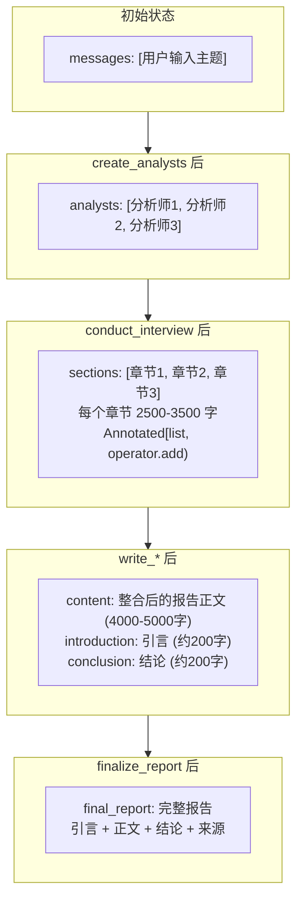
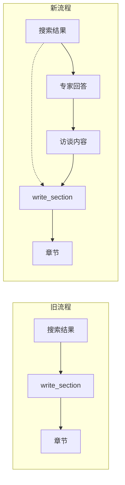

# STORM 完整运行过程模拟

**研究主题**：大语言模型在教育领域的应用与挑战

---

## 一、整体流程概览



---

## 二、State 初始状态

```python
# 输入状态 (InputState)
{
    "messages": [
        HumanMessage(content="大语言模型在教育领域的应用与挑战")
    ]
}

# 配置参数 (Configuration)
{
    "model": "bailian/qwen-plus",
    "max_analysts": 3,
    "max_interview_turns": 3
}
```

---

## 三、节点执行过程详解

### 阶段 1：create_analysts（创建分析师）

**输入 State**：
```python
{
    "messages": [HumanMessage(content="大语言模型在教育领域的应用与挑战")]
}
```

**执行逻辑**：
1. 提取主题：`topic = "大语言模型在教育领域的应用与挑战"`
2. 调用 LLM 生成分析师（使用 `ANALYST_INSTRUCTIONS` 提示词）
3. 结构化输出 `Perspectives` 模型

**输出 State 变化**：
```python
{
    "analysts": [
        Analyst(
            name="张明",
            role="教育技术研究员",
            affiliation="北京师范大学教育技术学院",
            description="关注AI技术在课堂教学中的实际应用效果、教师培训需求及教学模式的变革"
        ),
        Analyst(
            name="李华",
            role="人工智能伦理专家",
            affiliation="中国科学院人工智能研究所",
            description="研究AI教育应用中的隐私保护、算法公平性、学术诚信等伦理问题"
        ),
        Analyst(
            name="王芳",
            role="教育政策分析师",
            affiliation="教育部教育发展研究中心",
            description="分析LLM教育应用的政策环境、监管框架及对教育公平的影响"
        )
    ]
}
```

---

### 阶段 2：conduct_interview（并行访谈子图）

使用 `Send` 为每位分析师启动独立的访谈子图。

#### 2.1 访谈子图流程



#### 2.2 访谈子图初始化

**每位分析师的初始 State**：
```python
# 分析师1 - 张明的访谈状态
{
    "analyst": Analyst(name="张明", role="教育技术研究员", ...),
    "messages": [HumanMessage(content="所以你说你正在写一篇关于 大语言模型在教育领域的应用与挑战 的文章？")],
    "max_num_turns": 3,
    "context": [],
    "interview": "",
    "sections": []
}

# 分析师2 - 李华的访谈状态
{
    "analyst": Analyst(name="李华", role="人工智能伦理专家", ...),
    "messages": [HumanMessage(content="所以你说你正在写一篇关于 大语言模型在教育领域的应用与挑战 的文章？")],
    "max_num_turns": 3,
    "context": [],
    "interview": "",
    "sections": []
}

# 分析师3 - 王芳的访谈状态
{
    "analyst": Analyst(name="王芳", role="教育政策分析师", ...),
    "messages": [HumanMessage(content="所以你说你正在写一篇关于 大语言模型在教育领域的应用与挑战 的文章？")],
    "max_num_turns": 3,
    "context": [],
    "interview": "",
    "sections": []
}
```

#### 2.3 访谈子图详细执行（以分析师1为例）

##### 轮次 1：ask_question

**输入**：
```python
{
    "analyst": Analyst(name="张明", description="关注AI技术在课堂教学中的实际应用效果..."),
    "messages": [HumanMessage(content="所以你说你正在写一篇关于 大语言模型在教育领域的应用与挑战 的文章？")]
}
```

**执行**：使用 `QUESTION_INSTRUCTIONS`，`goals = analyst.description`

**输出**：
```python
{
    "messages": [
        HumanMessage(content="所以你说你正在写一篇关于..."),
        AIMessage(content="你好！我是张明，来自北京师范大学教育技术学院。我主要研究AI技术在课堂教学中的实际应用效果。我想请问：目前大语言模型在K-12课堂教学中有哪些具体的应用场景？这些应用对学生学习效果产生了怎样的影响？")
    ]
}
```

##### 轮次 1：search_web / search_arxiv（并行）

**输入**：
```python
{
    "messages": [...最新消息是分析师的问题...]
}
```

**执行**：
1. 使用 `SEARCH_INSTRUCTIONS` 生成搜索查询
2. 执行搜索

**输出**：
```python
# search_web 输出
{
    "context": [
        """[Document source="https://edu.sina.com.cn/..."]
        大语言模型在K-12教育中的应用主要包括：智能辅导系统、作文批改、个性化学习路径推荐...
        研究显示，使用AI辅导的学生成绩平均提升15%...
        [/Document]""",
        """[Document source="https://www.chinanews.com/..."]
        北京多所中学引入AI助教系统，教师反馈备课效率提升40%...
        [/Document]"""
    ]
}

# search_arxiv 输出
{
    "context": [
        """[Document source="https://arxiv.org/abs/2401.xxxxx"]
        A Comparative Study of LLM-based Tutoring Systems in K-12 Education
        Abstract: This paper presents a systematic review of 50 studies...
        Key findings: personalized feedback improves learning outcomes by 23%...
        [/Document]"""
    ]
}
```

**State 变化**（context 累加）：
```python
{
    "context": [
        "web搜索结果1...",
        "web搜索结果2...",
        "arxiv搜索结果1..."
    ]
}
```

##### 轮次 1：generate_answer（专家回答）

**输入**：
```python
{
    "analyst": Analyst(...),
    "messages": [...问题...],
    "context": [搜索结果1, 搜索结果2, 搜索结果3]
}
```

**执行**：使用 `ANSWER_INSTRUCTIONS`，`context` 作为专家回答的依据

**输出**：
```python
{
    "messages": [
        ...,
        AIMessage(name="expert", content="""根据目前的研究和实践，大语言模型在K-12课堂教学中的应用场景主要包括：

1. **智能辅导系统**：为学生提供个性化的学习指导和答疑服务。研究表明，使用AI辅导的学生成绩平均提升15% [1]。

2. **作文批改与反馈**：AI可以快速批改学生作文，提供详细的修改建议。北京多所中学的实践显示，教师备课效率提升40% [2]。

3. **个性化学习路径**：根据学生的学习数据，推荐适合的学习内容和练习题目。一项系统性研究发现，个性化反馈可将学习效果提升23% [3]。

这些应用对学习效果的影响是显著的，但也存在一些挑战...

来源：
[1] https://edu.sina.com.cn/...
[2] https://www.chinanews.com/...
[3] https://arxiv.org/abs/2401.xxxxx""")
    ]
}
```

##### 轮次 2-3：循环继续

重复 `ask_question → search → answer` 流程，直到：
- 达到 `max_num_turns = 3`
- 或分析师说"非常感谢你的帮助"

##### save_interview（保存访谈）

**输入**：
```python
{
    "messages": [所有对话消息],
    "analyst": Analyst(...)
}
```

**执行**：将对话历史转换为字符串

**输出**：
```python
{
    "interview": ["""张明: 你好！我是张明...
expert: 根据目前的研究和实践...
张明: 追问一下，这些应用在不同学科中的效果有何差异？
expert: 根据研究数据...
张明: 非常感谢你的帮助！"""]
}
```

##### write_section（撰写章节）⭐ 关键更新

**输入**：
```python
{
    "analyst": Analyst(name="张明", description="关注AI技术在课堂教学中的实际应用效果、教师培训需求及教学模式的变革"),
    "context": [所有搜索结果],
    "interview": [完整访谈内容]
}
```

**执行**：
```python
# 将所有搜索结果合并
formatted_context = "\n\n".join(context) if context else "无搜索结果"

# 将访谈内容合并（优先使用）
formatted_interview = "\n\n".join(interview) if interview else "无访谈内容"

# 构建章节撰写提示词
system_message = SECTION_WRITER_INSTRUCTIONS.format(focus=analyst.description)

# 撰写章节：优先使用访谈内容，搜索结果作为补充
section = await model.ainvoke([
    SystemMessage(content=system_message),
    HumanMessage(content=f"""请根据以下信息撰写你的章节：

## 访谈内容：
{formatted_interview}

## 参考资料（搜索结果，必要时可引用）：
{formatted_context}""")
])
```

**关键分析**：

> **write_section 现在使用访谈内容 + 搜索结果**

新流程的核心改进：
1. **访谈内容优先**：完整的分析师-专家对话作为主要素材
2. **搜索结果补充**：原始搜索结果作为参考资料
3. **综合撰写**：基于专家回答的深度分析，撰写学术章节

**输出示例**：
```python
{
    "sections": [
        """## 大语言模型在课堂教学中的应用实践与效果分析

### 执行摘要

本研究章节聚焦于大语言模型（LLM）在K-12课堂教学中的实际应用场景及其对学生学习效果的影响。通过专家访谈和文献分析，我们发现...

### 深入分析

#### 智能辅导系统的应用现状

智能辅导系统是LLM在教育领域最成熟的应用之一。根据专家访谈，...研究表明，使用AI辅导的学生成绩平均提升15% [1]。

#### 教师培训与教学模式变革

随着AI工具的普及，教师角色正在发生深刻变化。北京多所中学的实践显示，教师备课效率提升40% [2]...

### 批判性讨论

尽管LLM在教育应用中展现出巨大潜力，但仍存在若干值得关注的问题...

### 来源
[1] https://edu.sina.com.cn/...
[2] https://www.chinanews.com/...
[3] https://arxiv.org/abs/2401.xxxxx

（总字数约 3000 字）"""
    ]
}
```

#### 2.4 访谈子图完成后的主图 State

三位分析师并行完成访谈后，State 变化：

```python
# 主图状态 (ResearchGraphState)
{
    "topic": "大语言模型在教育领域的应用与挑战",
    "analysts": [Analyst1, Analyst2, Analyst3],
    "sections": [
        "## 大语言模型在课堂教学中的应用实践与效果分析\n...(张明的章节，约3000字)",
        "## 大语言模型教育应用的伦理挑战与应对策略\n...(李华的章节，约3000字)",
        "## 大语言模型教育应用的政策环境与监管框架\n...(王芳的章节，约3000字)"
    ],
    "introduction": "",
    "content": "",
    "conclusion": "",
    "final_report": ""
}
```

---

### 阶段 3：write_report / write_introduction / write_conclusion（并行）



#### 3.1 write_report

**输入**：
```python
{
    "topic": "大语言模型在教育领域的应用与挑战",
    "sections": [
        "张明的章节...",
        "李华的章节...",
        "王芳的章节..."
    ]
}
```

**执行**：
```python
# 拼接所有章节
formatted_sections = "\n\n".join(sections)

# 构建提示词
system_message = REPORT_WRITER_INSTRUCTIONS.format(
    topic="大语言模型在教育领域的应用与挑战",
    context=formatted_sections  # 所有章节作为上下文
)

# 调用 LLM
report = await model.ainvoke([
    SystemMessage(content=system_message),
    HumanMessage(content="根据这些备忘录撰写报告。")
])
```

**输出**：
```python
{
    "content": """## 洞察

### 背景与理论基础

大语言模型（LLM）作为人工智能领域的重大突破，正在深刻改变教育领域的面貌...

### 文献综述与相关工作

近年来，多项研究探讨了LLM在教育中的应用...

### 问题定义与研究问题

本研究聚焦于以下核心问题：
1. LLM在K-12教育中有哪些具体应用场景？
2. 这些应用对学生学习效果产生了怎样的影响？
3. 存在哪些伦理挑战和监管问题？

### 方法论与分析框架

本研究采用多视角访谈方法，从教育技术、伦理和政策三个维度...

### 结果与发现

综合三位分析师的访谈发现，LLM在教育领域的应用呈现以下特点...

### 批判性分析与讨论

尽管LLM展现出巨大潜力，但我们需要审慎看待...

### 战略影响与建议

基于研究发现，我们提出以下建议...

## 来源
[1] https://edu.sina.com.cn/...
[2] https://www.chinanews.com/...
[3] https://arxiv.org/abs/2401.xxxxx
...

（总字数约 4500 字）"""
}
```

#### 3.2 write_introduction

**输入**：
```python
{
    "topic": "大语言模型在教育领域的应用与挑战",
    "sections": [三个分析师的章节]
}
```

**输出**：
```python
{
    "introduction": """# 大语言模型在教育领域的应用与挑战

## 引言

随着人工智能技术的飞速发展，大语言模型（LLM）正在重塑教育的面貌。本文从教育技术应用、伦理挑战和政策监管三个维度，深入探讨LLM在教育领域的应用现状、存在问题及未来发展方向。通过多视角的专家访谈和深入分析，我们揭示了LLM在课堂教学中的创新应用，审视了伴随而来的伦理困境，并提出了政策建议。本文旨在为教育工作者、政策制定者和研究人员提供全面的参考。"""
}
```

#### 3.3 write_conclusion

**输入**：与 write_introduction 相同

**输出**：
```python
{
    "conclusion": """## 结论

本研究通过多视角分析，全面考察了大语言模型在教育领域的应用与挑战。研究发现，LLM在智能辅导、个性化学习等方面展现出显著成效，但同时也带来了隐私保护、学术诚信等伦理问题。未来，我们需要在技术创新与伦理约束之间寻求平衡，建立完善的监管框架，确保AI技术真正服务于教育公平和质量提升。建议进一步关注教师培训、算法透明度和教育公平等议题。"""
}
```

---

### 阶段 4：finalize_report（组装最终报告）

**输入**：
```python
{
    "introduction": "# 大语言模型...\n\n## 引言\n...",
    "content": "## 洞察\n\n### 背景与理论基础\n...",
    "conclusion": "## 结论\n..."
}
```

**执行**：
```python
# 移除 "## 洞察" 标题
content = content.strip("## 洞察")

# 分离来源部分
content, sources = content.split("\n## 来源\n")

# 组装最终报告
final_report = (
    introduction
    + "\n\n---\n\n## 核心观点\n\n"
    + content
    + "\n\n---\n\n"
    + conclusion
)

if sources:
    final_report += "\n\n## 来源\n" + sources
```

**输出**：
```python
{
    "final_report": """# 大语言模型在教育领域的应用与挑战

## 引言

随着人工智能技术的飞速发展...

---

## 核心观点

### 背景与理论基础

大语言模型（LLM）作为人工智能领域的重大突破...

### 文献综述与相关工作

近年来，多项研究探讨了LLM在教育中的应用...

### 问题定义与研究问题

本研究聚焦于以下核心问题...

### 方法论与分析框架

本研究采用多视角访谈方法...

### 结果与发现

综合三位分析师的访谈发现...

### 批判性分析与讨论

尽管LLM展现出巨大潜力...

### 战略影响与建议

基于研究发现，我们提出以下建议...

---

## 结论

本研究通过多视角分析...

## 来源
[1] https://edu.sina.com.cn/...
[2] https://www.chinanews.com/...
[3] https://arxiv.org/abs/2401.xxxxx
..."""
}
```

---

## 四、关键问题解答

### 问题 1：write_section 使用什么素材撰写章节？

**答案：访谈内容（优先）+ 搜索结果（补充）**

新流程的核心改进：
```python
# 撰写章节时的输入
HumanMessage(content=f"""请根据以下信息撰写你的章节：

## 访谈内容：
{formatted_interview}  # 完整的分析师-专家对话

## 参考资料（搜索结果，必要时可引用）：
{formatted_context}  # 原始搜索结果
""")
```

**优势**：
1. **访谈内容优先**：专家回答已经过筛选和综合，质量更高
2. **搜索结果补充**：保留原始来源，确保可追溯性
3. **深度分析**：基于专家回答进行批判性思考和原创综合

---

### 问题 2：write_report 是拼接 section，还是结合访谈结果生成章节？

**答案：综合所有章节进行原创性整合**

证据：
- 提示词要求：`将这些单独的备忘录转化为一份连贯、有洞察力的研究报告`
- 强调：`超越总结的原创综合`
- 输出字数：`至少 4,000-5,000 字`

**不是简单拼接**，而是：
1. 深度分析每个备忘录的核心发现
2. 识别跨领域主题和模式
3. 重新组织成连贯的学术报告结构

---

### 问题 3：引言和结论是否基于 sections 撰写？会有割裂吗？

**答案：基于 sections 撰写，不会割裂**

证据：
- 提示词明确：`你将获得报告的所有章节`
- 输入参数：`formatted_str_sections=formatted_sections`

**连贯性保证**：
1. 引言基于所有章节撰写，能够准确预览报告内容
2. 结论基于所有章节撰写，能够准确总结研究发现
3. write_report 基于所有章节整合，确保正文连贯

---

## 五、State 变化流程图



---

## 六、数据流总结

| 阶段 | 输入 | 处理 | 输出 |
|------|------|------|------|
| create_analysts | 用户主题 | LLM 生成 | 3 个分析师 |
| conduct_interview | 分析师 + 主题 | 访谈子图 | 3 个章节（各 2500-3500 字） |
| write_report | 3 个章节 | LLM 整合 | 报告正文（4000-5000 字） |
| write_introduction | 3 个章节 | LLM 撰写 | 引言（200 字） |
| write_conclusion | 3 个章节 | LLM 撰写 | 结论（200 字） |
| finalize_report | 引言 + 正文 + 结论 | 拼接组装 | 最终报告 |

---

## 七、新流程核心改进

### 改进点：write_section 使用专家回答

**旧流程**：
```
write_section 只使用搜索结果 (context)
→ 章节完全依赖原始搜索结果
→ 可能缺乏深度分析和综合
```

**新流程**：
```
write_section 使用访谈内容 + 搜索结果
→ 访谈内容优先（专家已筛选和综合）
→ 搜索结果作为补充（保留原始来源）
→ 章节质量更高，分析更深入
```

### 数据流对比



---

## 八、设计评价

### 优点

1. **章节撰写更深入**：write_section 使用专家回答，质量更高
2. **报告整合有原创性**：write_report 不是简单拼接，而是进行原创性综合
3. **引言/结论基于章节**：确保了全文连贯性
4. **并行设计高效**：访谈并行、报告撰写并行

### 潜在问题

1. **引言和结论并行撰写**：可能导致表述不一致
2. **write_report 可能丢失细节**：整合过程中可能丢失某些章节的独特见解
3. **缺少大纲生成**：没有显式的大纲生成环节，可能导致结构不够清晰

### 改进建议

1. 考虑串行撰写引言和结论，或增加一致性检查
2. 在 write_report 前增加大纲生成节点
3. 保留原始章节作为附录，供读者参考